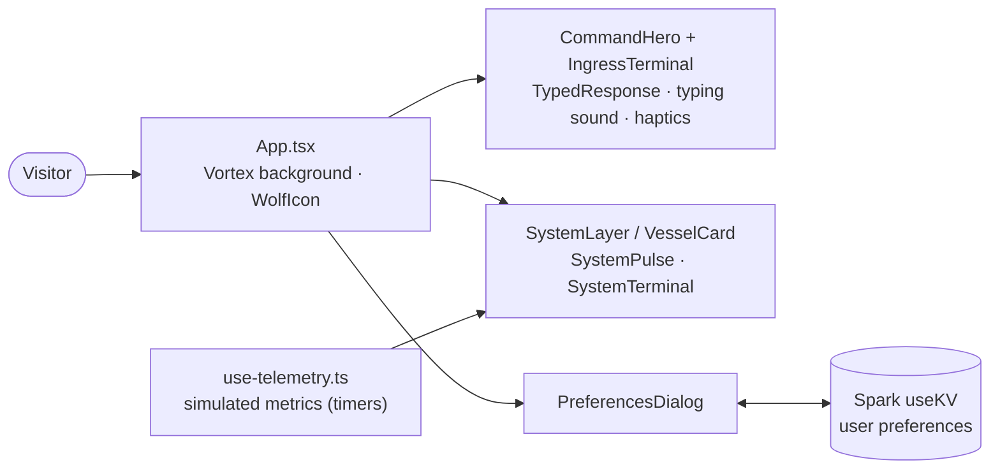

# Frisky Command Deck

**Boutique-studio "command deck" interface with a command-driven hero and a live-looking systems dashboard**

[](LICENSE)    

A single-page front end for Frisky Dev, described in [`PRD.md`](PRD.md) as a "boutique studio interface". It has a dark obsidian command hero with an ingress terminal and typed responses, a vessel/system monitoring layer, and user preferences (sound, haptics, motion) that persist through the Spark KV store. It is built on the GitHub Spark template (Vite + React). The telemetry and terminal log feed are **simulated client-side** (`use-telemetry.ts` and `SystemTerminal.tsx` use timers and random values). It doesn't call any backend yet. It is for the Frisky team as the visual shell of an operator dashboard.

## Architecture



## Stack

- React 19 + TypeScript on Vite with `@vitejs/plugin-react-swc` (GitHub Spark template)
- Tailwind CSS 4, shadcn/ui on Radix, Phosphor icons (see [ICONS.md](ICONS.md))
- Framer Motion; the wider Frisky frontend standard is documented in [STACK.md](STACK.md)

## Project structure

```text
PRD.md  STACK.md  ICONS.md
src/
  App.tsx          page composition
  components/      CommandHero, IngressTerminal, SystemLayer, VesselCard, SystemTerminal, …
  hooks/           use-telemetry, use-preferences, use-typing-effect, use-haptic, …
  lib/runes.ts     rune glyph data
```

## Local development

```bash
# Install dependencies
npm install

# Vite dev server
npm run dev

# Type-check and production build
npm run build
```

## Deploy

No deploy target is configured in this repo (no workflows or hosting config). `npm run build` outputs a static bundle to `dist/`. Preferences rely on the Spark KV runtime.

## Status

Early-stage UI. It overlaps with [nbu-operator-console](https://github.com/FriskyDevelopments/nbu-operator-console) (also a Spark operator dashboard), so pick one canonical operator dashboard before production work. Related: [NEBU-](https://github.com/FriskyDevelopments/NEBU-).

## License

See [LICENSE](LICENSE).
